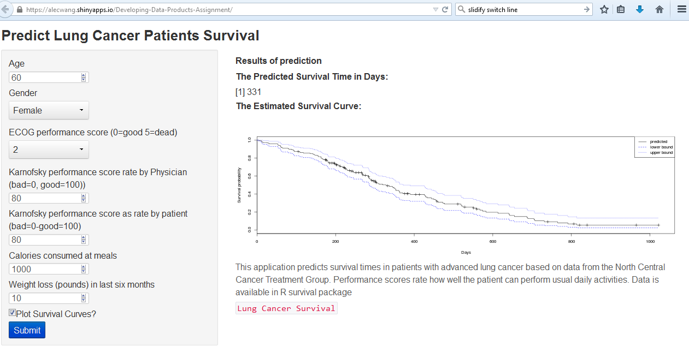

## Introduction

Based on the survival data in patients with advanced lung cancer from the North Central Cancer Treatment Group, this shiny APP builds Accelerated failure time (AFT) model using the 7 predictor vaiables. The users can then use the model to predict the survival times by entering the predictor variables. The APP also has the option to plot the estimated survival curves from the Cox PH model using this data set.

Learning Repository located here. 

--- 

## The Response and Predictor Variables
The respnse variable is the survival time in days. The minimum survival/censoring time is 5 days while the maximum survival/censoring time is 1022 days.

There are seven predicator variables used here:

1. age: Age in years
2. sex: Male/Female
3. ph.ecog: ECOG performance score (0=good 5=dead)
4. ph.karno: Karnofsky performance score (bad=0-good=100) rated by physician
5. pat.karno: Karnofsky performance score (bad=0-good=100) rated by patient
6. meal.cal: Calories consumed at meals
7. wt.loss: Weight loss in last 6 months

--- 

## The Prediction Model
The prediction model is based on an AFT model wiht Weibull baseline distribution. 

data(lung)
mod_AFT<-survreg(Surv(time,status-1)~age+factor(sex)+ph.ecog+ph.karno+pat.karno+meal.cal+wt.loss, data=lung,dist="weibull")

The App also provides plot options for plotting survival curves using Cox PH model

mod_PH<-coxph(Surv(time,status-1)~age+factor(sex)+ph.ecog+ph.karno+pat.karno+meal.cal+wt.loss, data=lung)
 plot(survfit(mod_PH), lty = c(1,2,3), col=c(1,4,4), xlab="Days", ylab="Survival probability") 
      legend ("topright",c("predicted","lower bound","upper bound"), lty = c(1,2,3), col=c(1,4,4))

--- 

## The APP
After users input values using the right side pannel and click the submit button, the predicted survival time will be displayed. The survival curve shows how the overall survival probabilities change with time.

--- 
